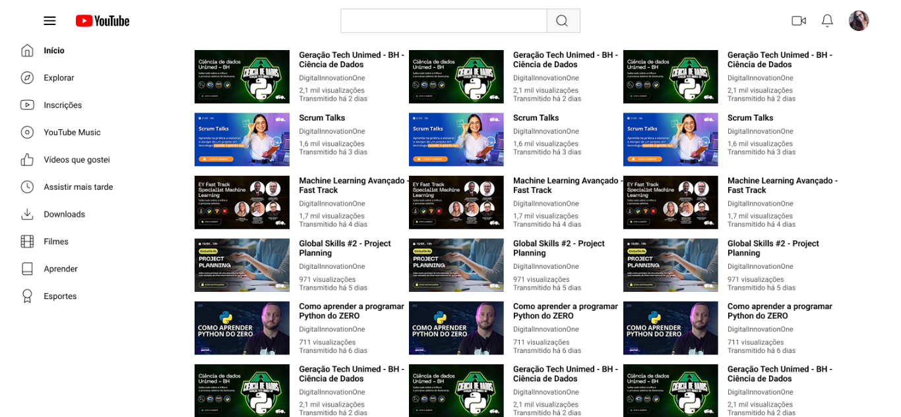

# 📺 Clone da Página do YouTube

Este projeto é um clone da interface do YouTube, desenvolvido com **HTML5** e **CSS3**. Foi criado com o objetivo de praticar e demonstrar habilidades em desenvolvimento front-end, focando em responsividade, semântica e fidelidade visual.

---

## ✨ Demonstração

> _"Mais que um repositório, um diário de aprendizado."_ 📚

---

## 🚀 Tecnologias Utilizadas

- ✅ HTML5
- ✅ CSS3 (Flexbox, Grid e responsividade)
- ✅ Ícones do Google (Material Icons)
- ✅ Estrutura sem frameworks — puro HTML e CSS

---

## 📂 Estrutura do Projeto

## 🎯 Objetivos de Aprendizado

- Prática de **HTML semântico**
- Uso de **CSS3**
- Aprimorar a organização de arquivos em projetos front-end
 

---

## 📌 Status do Projeto

🟢 **Concluído** — mas aberto a melhorias e sugestões!

---

## 🧠 Aprendizados

Durante o desenvolvimento deste projeto, reforcei conceitos como:

- Organização de seções usando `div`, `header`, `footer`
- Importação e uso de fontes e ícones externos

---

## 🙌 Agradecimentos

Este projeto foi inspirado na interface real do YouTube para fins educacionais.  
Todo o conteúdo é fictício e sem fins comerciais.

---

## 📎 Licença

Este projeto está sob a licença MIT.  
Sinta-se livre para usar como base para seus próprios estudos!

---

## 💻 Autor

Feito com 💙 por [Seu Nome Aqui]  
  

---
